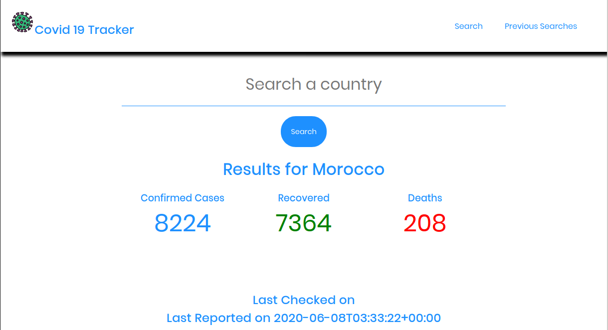
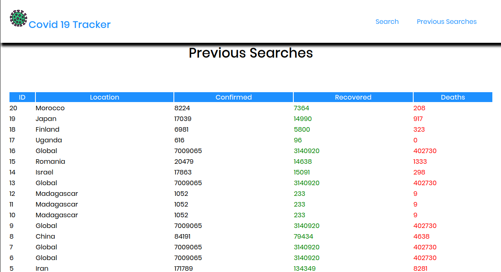

# Covid 19 Tracker
 This is an app that tracks information on Covid 19 basing on country.

## Built With
- Flask (the web framework)
- Requests (the library for making API calls)
- MySQL (for data persistence)
- HTML
- CSS

## API 

If you want to make your own, [The Api is here.](https://covid-19-coronavirus-statistics.p.rapidapi.com/v1/total)

## The live demo
[Production site](https://simple-deployment-demo.herokuapp.com/)

## Install Project ependencies With
` pip3 install -r requirements.txt`

## Run With
` python 3 app.py `

